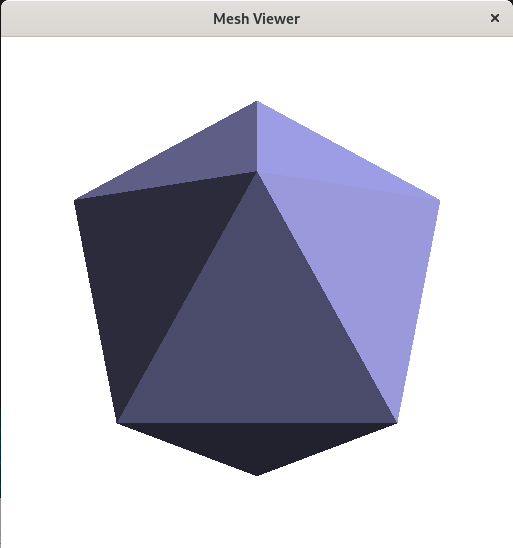
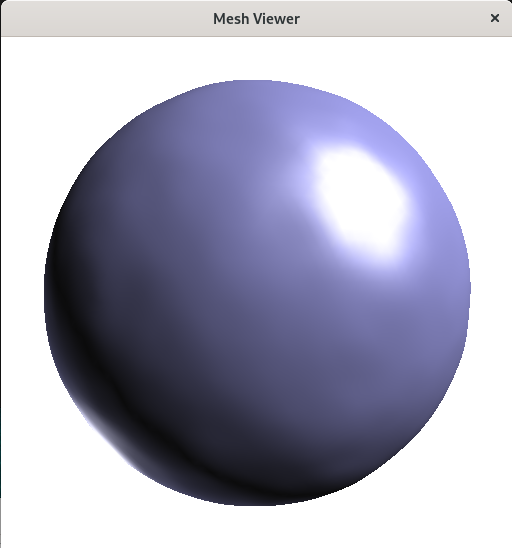
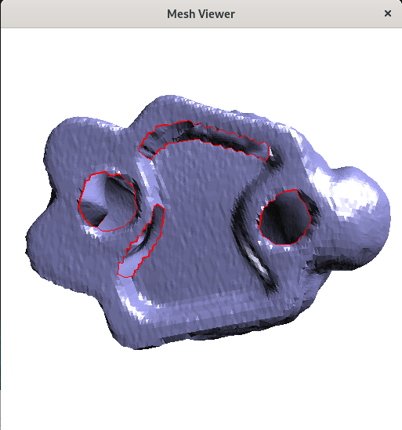

# Programming task 1: Triangle mesh generation
### make icosahegron.c and icosahedron.off

# Programming task 2: Mesh processing
### Task 2: Heat diffusion

### Task 3: Holes detection and visualization

